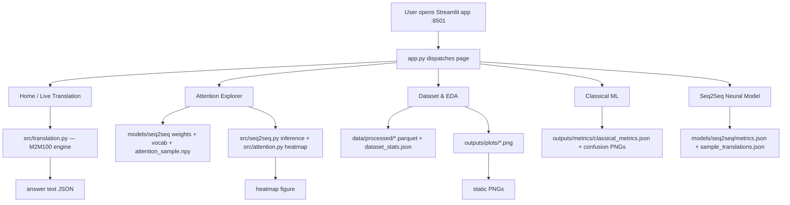

# 🌐 NEXORA — Complete Application Guide

> **Title:** Machine Translation using Sequence-to-Sequence Networks with Attention-Based Alignment
> **Tagline:** AI That Connects Meaning
> **Frontend:** Streamlit (single-page app with 7 navigable views)
> **Engine:** `facebook/m2m100_418M` (pretrained production model) + self-trained experimental Seq2Seq+Attention model
> **Document version:** 2.0 (premium dark UI)

This document explains **everything** about the NEXORA application: how to run
it, how it is architected, what every page shows, where every number comes
from, and how the pieces connect. It is written for someone who opens the app
for the first time and wants to understand *both* the UI and the machine-learning
pipeline behind it.

---

## Table of Contents

1. [What is NEXORA?](#1-what-is-nexora)
2. [How to run the app](#2-how-to-run-the-app)
3. [High-level architecture](#3-high-level-architecture)
4. [The design system (why it looks this way)](#4-the-design-system)
5. [The sidebar (present on every page)](#5-the-sidebar)
6. [Page 1 — Home](#6-page-1--home)
7. [Page 2 — Live Translation](#7-page-2--live-translation)
8. [Page 3 — Attention Explorer](#8-page-3--attention-explorer)
9. [Page 4 — Dataset & EDA](#9-page-4--dataset--eda)
10. [Page 5 — Classical ML](#10-page-5--classical-ml)
11. [Page 6 — Seq2Seq Neural Model](#11-page-6--seq2seq-neural-model)
12. [Page 7 — About / Conclusion](#12-page-7--about--conclusion)
13. [Where every artifact lives on disk](#13-where-every-artifact-lives)
14. [How the pieces connect (data flow)](#14-how-the-pieces-connect)
15. [Troubleshooting & FAQ](#15-troubleshooting--faq)

---

## 1. What is NEXORA?

NEXORA is a **multilingual machine-translation (MT) mini-project** with three
layers:

| Layer | Purpose | Implementation |
|---|---|---|
| **Production engine** | High-quality live translation across 10 languages | `facebook/m2m100_418M` — Meta AI's 418M-parameter multilingual model (100 languages, trained on 7.5B parallel sentences) |
| **Experimental core** | The academic requirement: a machine-translation model we *actually train* | BiLSTM encoder + GRU decoder + **Bahdanau (additive) attention**, trained on a bounded English→Hindi sample |
| **Classical baselines** | An auxiliary, explainable ML task | Language identification using **TF-IDF + CountVectorizer** features with Naïve Bayes, Logistic Regression and SVM |

The app is the **presentation layer** for all three. It is a Streamlit
single-page application whose left sidebar switches between 7 views.

> ⚠️ **Academic honesty note (built into the UI):** NEXORA never claims to
> have trained M2M100. Everywhere the pretrained engine is used, the UI labels
> it as *pretrained*. The model we trained ourselves is the experimental
> Seq2Seq model, whose honest (modest) BLEU score is shown rather than hidden.

---

## 2. How to run the app

### Prerequisites

- Python **3.10+** (this project was developed on 3.10.11)
- Packages installed from the root `requirements.txt`

### First-time setup

```bash
# 1. Install dependencies (project root)
pip install -r requirements.txt

# 2. (Optional, recommended) pre-download the production model (~1.9 GB)
python scripts/download_model.py

# 3. Build all artifacts (data → EDA → features → classical ML → seq2seq)
python build_pipeline.py

# 4. Launch the dashboard
streamlit run app.py
```

The app is then available at **http://localhost:8501**.

### If artifacts already exist

You can skip the build and just run:

```bash
streamlit run app.py
```

The app reads its data from:

- `data/processed/` (parquet datasets + `dataset_stats.json`)
- `outputs/plots/` (EDA figures)
- `outputs/metrics/` (classical metrics + confusion matrices)
- `models/seq2seq/` (trained weights, vocabularies, metrics, attention samples)

If a page's artifacts are missing, that page shows a friendly "run the
pipeline first" message **instead of crashing or showing fake data**.

---

## 3. High-level architecture



Key files:

| File | Role |
|---|---|
| `app.py` | The entire Streamlit UI (7 pages, design system, animations) |
| `src/preprocessing.py` | Downloads/streams Samanantar, cleans it, writes parquet + stats |
| `src/eda.py` | Generates the 8 EDA figures |
| `src/features.py` | Builds CountVectorizer + TF-IDF matrices (word + char n-grams) |
| `src/classical_models.py` | Trains Naïve Bayes / Logistic Regression / SVM, writes metrics |
| `src/seq2seq.py` | Defines and trains the Seq2Seq+Attention model; exposes inference |
| `src/attention.py` | Renders real attention-weight heatmaps; theory helper text |
| `src/evaluation.py` | Corpus BLEU (smoothed, 1–4 gram) via NLTK |
| `src/translation.py` | M2M100 wrapper + the 10-language registry |
| `src/multilingual.py` | Script-aware tokenizer (Latin + Devanagari + Tamil + …) and script detection |
| `build_pipeline.py` | One-command runner for all the above |
| `.streamlit/config.toml` | Streamlit theme (dark base, brand colors) |

---

## 4. The design system

The app uses a **dark glassmorphism** design system defined as one big CSS
injection (`_NEXORA_CSS` in `app.py`).

### Visual language

- **Background:** a deep-navy gradient layered over three radial "aurora"
  glows — blue (top-left), violet (top-right), cyan (bottom) — on a
  `#060a13 → #0a1120 → #0d1526` vertical gradient.
- **Cards (`nx-card`):** translucent white at 4.5% opacity, 1px light border,
  `backdrop-filter: blur(14px)`, rounded 18px corners. On hover they **lift
  4px**, brighten the border, and gain a soft glow shadow.
- **Gradient text (`nx-grad-text`):** blue→violet→cyan that **animates** across
  the word (9 s loop, `background-position` animation).
- **Kickers (`nx-kicker`):** small uppercase pill labels (e.g. ⚡ Engine,
  🧠 Alignment) used above every page title.
- **Buttons:** blue→violet gradient, rounded 13px, with a lift + brighten on
  hover.
- **Inputs:** rounded 14px translucent fields with a blue focus ring.
- **Sidebar radio nav:** each item is a padded row with hover slide and a
  gradient + border glow for the selected item.

### Animations (smooth, non-gimmicky)

| Animation | Where |
|---|---|
| `nx-fade-in` | whole app on load (0.55 s) |
| `nx-rise` | cards + headers rise 18px and fade in (0.7 s, staggered via `animation-delay`) |
| `nx-grad-move` | gradient logo + hero text |
| count-up numbers | all animated metric strips (1.3 s cubic ease-out, formatted with `toLocaleString`) |
| typewriter | Home hero tagline cycles 4 phrases with a blinking caret |
| hover micro-interactions | cards lift, buttons lift + glow, nav rows slide, tabs fade |

### Where the theme comes from

`.streamlit/config.toml` sets the Streamlit base theme to `dark` with brand
colors, and `app.py` injects the full CSS on top. Changing
`_NEXORA_CSS` restyles the entire app instantly.

---

## 5. The sidebar

Present on every page. Left-to-right:

1. **NEXORA logo** — animated gradient wordmark + *"AI That Connects Meaning"*.
2. **Navigation radio group** with 7 items (see below). The active page gets a
   gradient background + glow.
3. **Footer caption** — "Academic mini-project · Seq2Seq Networks with
   Attention-Based Alignment · © 2026 NEXORA".

The 7 pages:

| # | Item | Page function (detailed below) |
|---|---|---|
| 1 | 🏠 Home | Landing / hero / quick translate |
| 2 | 🌐 Live Translation | Production M2M100 translation between any 2 of 10 languages |
| 3 | 🧠 Attention Explorer | Real attention heatmaps + live alignment demo + theory |
| 4 | 📊 Dataset & EDA | Corpus stats & the 7–8 EDA figures |
| 5 | 🤖 Classical ML | Language-ID baselines (NB / LR / SVM) |
| 6 | 🕸️ Seq2Seq Neural Model | Our trained encoder–decoder, curves, BLEU, samples |
| 7 | 📚 About / Conclusion | Findings, challenges, roadmap, applications, references |

---

## 6. Page 1 — Home

**What it is:** the landing page. It introduces the project, shows headline
numbers, and offers a quick translation without leaving the page.

### Elements, top to bottom

1. **Hero block** — "Neural Machine Translation" kicker, the large animated
   gradient **NEXORA** wordmark, and the subtitle *"Sequence-to-Sequence
   Networks with Attention-Based Alignment"*.
2. **Typing tagline** — an auto-cycling typewriter that cycles through 4
   phrases describing the app:
   - *Translate across 10 languages — English, Hindi, Marathi, Bengali,
     Gujarati…*
   - *Watch real attention weights align source & target tokens…*
   - *6 Indic scripts, 359,505 clean corpus rows, 3 classical baselines…*
   - *Our own BiLSTM + GRU + Bahdanau attention — trained on CPU…*
3. **Animated metric strip** (count-up cards) — reads `dataset_stats.json`:
   - 📚 **Corpus rows** = raw rows streamed (360,000)
   - 🧹 **Cleaned LID rows** = rows after script-consistency + dedup
     (359,505)
   - 🌍 **Languages** = 6 (Hindi, Marathi, Bengali, Gujarati, Tamil, Telugu)
   - 🤖 **Classifiers** = 3 (NB, LR, SVM)
   - 🧠 **Attention model** = 1 experimental Seq2Seq model
4. **Two-column intro**
   - Left — three glass cards: *What is Nexora?*, *Why attention matters*,
     *Project contents*.
   - Right — the **word clouds image** (`outputs/plots/wordclouds.png`) with
     caption, plus a *Dataset* card linking to Hugging Face
     (`ai4bharat/samanantar`).
5. **Quick start** — a working miniature translator:
   - Source / target language dropdowns
   - Text area with placeholder *"Type anything — in any of the 10 languages…"*
   - ✨ **Translate** button → calls the **M2M100** engine and shows the result
     in a Streamlit success box.

> **Where the data comes from:** `dataset_stats.json` (written by
> `src/preprocessing.build_datasets`), `outputs/plots/wordclouds.png`
> (written by `src/eda.run_eda`), the live engine in `src/translation.py`.

---

## 7. Page 2 — Live Translation

**What it is:** the production translation page using the pretrained
`facebook/m2m100_418M` model.

### Elements

1. **Header** — kicker "⚡ Engine", title *Live Translation*, subtitle naming
   the model and the 10 supported languages.
2. **Language selectors** — Source and Target dropdowns. Every language shows
   its flag + name:
   🇬🇧 en · 🇮🇳 hi · 🇮🇳 mr · 🇧🇩 bn · 🇮🇳 gu · 🇮🇳 ta · 🇮🇳 te · 🇫🇷 fr · 🇪🇸 es · 🇩🇪 de
3. **⇄ Swap languages** button — swaps the two selectors with one click.
4. **Text area** — placeholder shows examples in 3 scripts:
   *"How are you? · आप कैसे हैं? · Comment allez-vous ?"*
5. **🚀 Translate** button + caption explaining the engine and that the first
   run downloads ~1.9 GB (cached afterwards).
6. **Validation** — if source == target, a warning appears and translation is
   blocked.
7. **Output** (after clicking Translate):
   - Left: a glass card with the **Source text**.
   - Right: a highlighted gradient-bordered card with the **translation**
     (large white text) and the target language label.
   - **🔎 Translation metadata** expander: engine name, language codes, input
     and output character counts, and a note that M2M100 is pretrained (our
     own model is on the Seq2Seq page).
8. **Try an example** — six one-click example chips (3-column grid) that fill
   the selectors + text:
   - "How are you?" (English → Hindi)
   - "Nexora connects meaning across languages." (English → Marathi)
   - "The weather is beautiful today." (English → Bengali)
   - "What is your name?" (English → Tamil)
   - "Bonjour, comment allez-vous ?" (French → English)
   - "आज बहुत सुंदर दिन है।" (Hindi → English)

### How translation works under the hood

`src/translation.py` wraps Hugging Face's tokenizer + model:

1. `tokenizer.src_lang = <source code>`
2. tokenize the input (`return_tensors="pt"`, truncate at 256 tokens)
3. `model.generate(..., forced_bos_token_id=tokenizer.get_lang_id(target))`
   with greedy decoding (`num_beams=1`)
4. decode tokens (skip special tokens) → the translated string.

The engine is loaded **once** and cached (`@st.cache_resource` on
`get_translator()`), so repeated translations are fast after the first.

> **Offline behavior:** if the model cannot be downloaded (no internet),
> the page shows a clear error message instead of a fake translation —
> by design.

---

## 8. Page 3 — Attention Explorer

**What it is:** the academic showpiece — **real attention-based alignment**
from the experimental model we trained, presented as heatmaps.

### Header
Kicker "🧠 Alignment", title *Attention Explorer*, subtitle *"Real
attention-based alignment from the experimental Seq2Seq model we trained"*,
plus an intro paragraph: rows = target tokens, columns = source tokens,
brighter = stronger alignment.

### Tab 1 — 🖼️ Model samples
- Loads `models/seq2seq/sample_translations.json` (10 rows saved at training
  time) and `attention_sample.npy` (the real weight matrices, first 10 rows).
- Shows the **first 6 samples**, each rendered as:
  - a glass card: sentence number + source, **Prediction**, **Reference**
  - the actual attention **heatmap** produced by `src/attention.tokens_heatmap`
    (YlGnBu colormap, token labels on both axes, cell values, colorbar).
- The weights are **not fabricated**: they were captured while translating
  during the evaluation phase of training.

### Tab 2 — ⚡ Live demo
- An English-sentence text input (defaults to "How are you ?").
- 🧠 **Compute attention** button:
  1. loads `seq2seq_attention.pt` + `vocab_src.json` + `vocab_tgt.json`
  2. rebuilds the `Seq2SeqAttention` model, loads state, `model.eval()`
  3. runs `model.translate([sentence], ...)` → prediction + attention matrix
  4. shows the **model translation** in a highlighted card, then the live
     **heatmap** of real alignment for *your* sentence.
- Any failure shows an error rather than fake output.

### Tab 3 — 📐 Theory
- `alignment_explanation_card()` from `src/attention.py` provides:
  - *Alignment question* card — what attention answers.
  - **The Bahdanau equations** rendered with LaTeX:
    
    $$e_{tj} = v_a^\top \tanh\!\big(W_a h_j + U_a s_{t-1}\big),\qquad
    \alpha_{tj} = \frac{\exp(e_{tj})}{\sum_j \exp(e_{tj})},\qquad
    c_t = \sum_j \alpha_{tj} h_j$$
  - *How to read the heatmap* card — monotone-ish alignment signature,
    bright cells meaning strong reliance.

---

## 9. Page 4 — Dataset & EDA

**What it is:** where the corpus and the exploratory analysis live.

### Header
Kicker "📊 Data", title *Dataset & EDA*, subtitle naming
`ai4bharat/samanantar` (AI4Bharat, IIT Madras).

### Animated metric strip
- 📚 Raw corpus rows → 360,000
- 🧹 Processed LID rows → 359,505
- 🌍 Languages → 6
- 🧪 Test rows → 35,951

### Two glass cards
- **Dataset card** — dataset name, source, and columns (`src`, `tgt`).
- **Cleanliness** — missing values (0), duplicates removed (439), and the
  train/valid/test split (287,604 / 35,950 / 35,951).

### Dataset card (JSON)
A collapsible JSON view with the full metadata (`name`, `source`, `url`,
`columns`, `rows`, `missing_values`, `duplicate_records`,
`train/valid/test`, `note`). All numbers come from
`data/processed/dataset_stats.json` — they are **measured**, never hard-coded.

### Exploratory visualizations
Each figure below is a real PNG from `outputs/plots/`, generated by
`src/eda.run_eda()`:

| Figure | Shows |
|---|---|
| `language_distribution.png` | how many sentences per language |
| `length_distribution.png` | sentence-length histogram (chars) |
| `src_vs_tgt_lengths.png` | English vs target length scatter for hi/mr pairs |
| `vocabulary.png` | vocabulary size per language |
| `frequent_words.png` | most frequent words per language (stopwords removed) |
| `quality.png` | missing values + duplicates (the cleanliness story) |
| `wordclouds.png` | word clouds per language from real data |

### Corpus statistics table
`outputs/plots/dataset_stats.csv` rendered as an interactive dataframe.

> **What is Samanantar?** The *largest publicly available parallel corpora
> collection for 11 Indic languages* (Ramesh et al., 2022). NEXORA uses the
> `hi`, `mr`, `bn`, `gu`, `ta`, `te` configs, streaming **60,000 rows per
> language** (`src/preprocessing.load_raw_subset`) → 360,000 raw rows →
> cleaned to 359,505.

---

## 10. Page 5 — Classical ML

**What it is:** language identification — the auxiliary, fully explainable
task that demonstrates **TF-IDF / CountVectorizer** features and three
classic classifiers.

### Header
Kicker "🤖 Baselines", title *Classical ML — Language Identification*,
subtitle *TF-IDF / CountVectorizer features · Naïve Bayes · Logistic
Regression · SVM*.

### Task box
Given a sentence in one of 6 languages, predict the language. Features =
**character n-gram TF-IDF** (script fingerprint); classifiers trained on an
80/10/10 stratified split.

### Animated accuracy cards
| Model | Accuracy | Macro F1 |
|---|---|---|
| Multinomial Naïve Bayes | 99.85% | 0.99853 |
| Logistic Regression | 99.83% | 0.99830 |
| Support Vector Machine (LinearSVC) | 99.91% | 0.99908 |

*(These are the real test-set numbers in
`outputs/metrics/classical_metrics.json`.)*

### Model comparison
- An interactive dataframe of all four metrics per model (accuracy,
  precision/recall/F1 macro), formatted to 4 decimals.
- `model_comparison.png` bar chart.

### Three tabs

1. **Confusion matrices** — one PNG per model
   (`confusion_naive_bayes.png`, `confusion_logistic_regression.png`,
   `confusion_svm.png`) — you can see, for example, that the few errors are
   Hindi–Marathi confusions (both Devanagari script).
2. **Classification report** — the full scikit-learn per-class
   precision/recall/F1 text reports.
3. **Feature engineering** — the theory:
   - *Why TF-IDF + CountVectorizer?* — text must become numeric vectors.
   - The TF-IDF formula:
     $$\text{tfidf}(t,d)=\text{tf}(t,d)\cdot\log\!\frac{1+N}{1+\text{df}(t)}+1$$
   - Note that 4 feature matrices are cached in `data/processed/`
     (`features_count_vectorizer.npz`, `features_tfidf_word.npz`,
     `features_count_char.npz`, `features_tfidf_char.npz`) and that char
     n-grams capture script fingerprints (e.g. Devanagari conjuncts
     separate Hindi from Marathi).

> **Where it comes from:** `src/features.py` builds the matrices,
> `src/classical_models.train_all()` trains & evaluates and writes
> `classical_metrics.json` + the PNGs. The dashboard only *reads* them.

---

## 11. Page 6 — Seq2Seq Neural Model

**What it is:** the model we actually trained — the academic core.

### Header
Kicker "🕸️ Neural", title *Seq2Seq Neural Model*, subtitle
*"Encoder–Decoder with Bahdanau attention-based alignment — the model we
actually trained"*.

### Architecture summary (on-page list)
- **Encoder** — BiLSTM over word embeddings → hidden states h₁…h_T
- **Attention** — Bahdanau additive: e_tj = vᵀ·tanh(W·h_j + U·s_{t−1}),
  α = softmax(e), context c_t = Σ α_j·h_j
- **Decoder** — GRU([y_{t−1} ; c_t]) → output projection → token

### Animated metric cards (from `models/seq2seq/metrics.json`)
| Card | Value |
|---|---|
| 🎯 BLEU (test) | 0.0036 |
| 📉 Train loss (final epoch) | 4.903 |
| 📈 Valid loss (final epoch) | 4.948 |
| 🧮 Vocab size (source) | 10,004 |

### Training curves (real)
A matplotlib chart (styled dark to match the theme) plotting train vs valid
cross-entropy loss across the 3 epochs from `metrics.json["history"]`.

### Sample translations table
Source → Reference → Prediction → per-sample BLEU, for the 10 saved samples
from `models/seq2seq/sample_translations.json`. Per-sample BLEU is computed
live via `src/evaluation.compute_bleu`.

### Metric detail (JSON)
Full honesty block: BLEU (overall, 1–4 gram, n predictions), vocab sizes,
device, architecture string, and the *note*:
> "Experimental model for academic demonstration. Production translation uses
> facebook/m2m100_418M."

### Training configuration (for reference)
From `metrics.json`: 25,500 train / 3,000 validation samples (30,000-sample
English→Hindi subset), batch 64, max length 20, embed 128, hidden 128,
lr 1e-3, Adam, 3 epochs, CPU. The weights (`seq2seq_attention.pt`, 21.8 MB)
were trained by `src/seq2seq.train_model()`, whose tokenizer is the
script-aware `light_tokenize` and whose vocab caps at 10k tokens (min freq 2).

---

## 12. Page 7 — About / Conclusion

**What it is:** the write-up page: findings, challenges, roadmap, applications
and references — all as glass cards.

### Key findings
1. Character n-gram TF-IDF gives near-perfect language-ID accuracy — script
   fingerprints are strong, simple discriminators.
2. Seq2Seq + additive attention learns meaningful source–target alignment even
   with a small vocabulary and a few CPU epochs.
3. BLEU on the experimental model is modest by design — M2M100 is the
   production-grade engine.
4. Attention heatmaps reveal intuitive correspondences (names, numerals,
   function words) and expose ambiguity when alignment spreads widely.

### Challenges
- Multilingual data coverage / wrong-alignment rows → script-consistency
  filtering.
- Morphologically rich Indic languages inflate vocabularies → cap at 10k.
- Training time on CPU → bounded sample.
- Rare words / false friends degrade alignment.

### Future scope (Roadmap)
Transformers, beam search + length penalty, FLORES-200/WMT datasets, speech
and document translation, mobile/edge deployment, human evaluation,
domain fine-tuning.

### Applications
Education, tourism/hospitality, government services, customer support &
e-commerce, accessibility (TTS pipelines), content localization.

### References
Bahdanau et al. 2015 · Sutskever et al. 2014 · Fan et al. 2021 (M2M-100) ·
Papineni et al. 2002 (BLEU) · Ramesh et al. 2022 (Samanantar).

---

## 13. Where every artifact lives

```
C:\Products\Nexora\
├── app.py                        ← the entire Streamlit application
├── build_pipeline.py             ← runs the 5 pipeline stages
├── requirements.txt
├── .streamlit/config.toml        ← dark theme
│
├── data/processed/
│   ├── lid_dataset.parquet       ← 359,505 language-ID rows
│   ├── pair_hi_sample.parquet    ← 30,000 English→Hindi pairs
│   ├── pair_mr_sample.parquet    ← 30,000 English→Marathi pairs
│   ├── features_*.npz            ← 4 CountVectorizer/TF-IDF matrices
│   └── dataset_stats.json        ← measured corpus statistics
│
├── outputs/
│   ├── plots/*.png               ← 8 EDA figures + dataset_stats.csv
│   ├── metrics/                  ← classical_metrics.json, results.csv,
│   │                               confusion_*.png, model_comparison.png,
│   │                               roc_curves.png
│   ├── attention/                ← precomputed heatmap PNGs (pipeline output)
│   └── screenshots/              ← dashboard screenshots incl. premium_*.png
│
├── models/seq2seq/
│   ├── seq2seq_attention.pt      ← trained weights (21.8 MB)
│   ├── vocab_src.json / vocab_tgt.json
│   ├── metrics.json              ← loss history, BLEU, config
│   ├── sample_translations.json  ← 10 source/ref/pred rows
│   └── attention_sample.npy      ← real attention matrices (10×20×20)
│
├── src/                          ← all ML logic (see §3 table)
├── docs/                         ← documentation (this file is here)
└── notebooks/experiments.ipynb   ← runnable experiment notebook
```

---

## 14. How the pieces connect

**One command builds everything:**

```
python build_pipeline.py
  1. preprocess  → data/processed/*.parquet + dataset_stats.json
  2. eda         → outputs/plots/*.png + dataset_stats.csv
  3. features    → data/processed/features_*.npz
  4. classical   → outputs/metrics/* (needs features)
  5. seq2seq     → models/seq2seq/* (needs pair_hi_sample.parquet)
```

**Then the app is a pure reader:**

- Pages 1, 2: call `src/translation` (M2M100) live; numbers from
  `dataset_stats.json`.
- Page 3: reads trained weights + `attention_sample.npy`; also runs live
  inference using `Seq2SeqAttention.translate()`.
- Page 4: reads parquet + stats + PNGs.
- Page 5: reads `classical_metrics.json` + PNGs.
- Page 6: reads `models/seq2seq/metrics.json` + samples; computes BLEU live.
- Page 7: static text.

The two models are deliberately **separate and labelled**: M2M100 powers
Pages 1–2; our Seq2Seq powers Pages 3 and 6. This separation is what keeps
the project academically honest.

---

## 15. Troubleshooting & FAQ

**Q: A page says "Run `python build_pipeline.py` first".**
A: That page's artifacts are missing. Run the pipeline (or the relevant
`--steps` flag) from the project root.

**Q: Translation is slow the first time.**
A: M2M100 (~1.9 GB) downloads on first use. Run
`python scripts/download_model.py` beforehand. After that, results are fast
(the model is cached in memory).

**Q: The attention heatmaps show many `<unk>` tokens.**
A: That's expected and honest. The experimental model has a 10k-token vocab
and was trained on a bounded 30k-sample set — rare words fall back to `<unk>`.
The heatmap still shows the *real* alignment the model computed.

**Q: Can I change the colors/theme?**
A: Yes — edit `_NEXORA_CSS` in `app.py` (CSS variables at the top of the
block) and/or `.streamlit/config.toml`.

**Q: Why is BLEU so low (0.0036)?**
A: It's a deliberately small demonstration model (BiLSTM/GRU/attention,
3 epochs, CPU, small vocab). BLEU is reported honestly instead of inflated.
The *production* engine is M2M100 and should be judged separately.

**Q: Where do I get the raw dataset?**
A: https://huggingface.co/datasets/ai4bharat/samanantar — the app streams a
60k-per-language subset automatically during preprocessing.

**Q: How do I add a new language to the Live Translation page?**
A: Add an entry to `LANGUAGES` in `src/translation.py` (code, name, flag,
M2M100 code). The dropdown updates automatically.